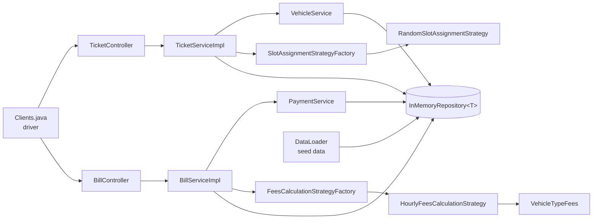
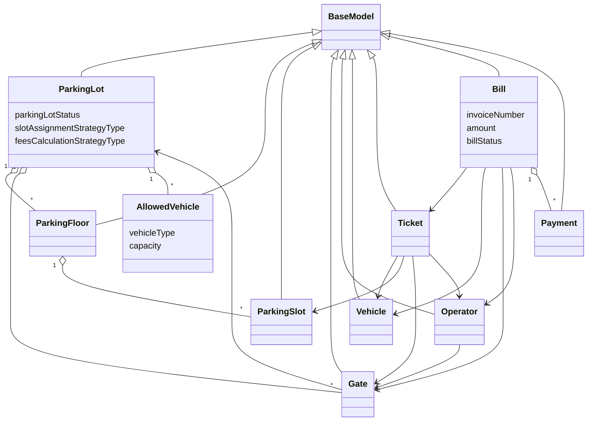
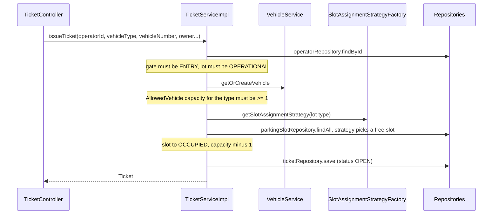

# Parking Lot

Package: `learn.pakinglot` · Java 21 · Maven · Lombok · no framework, no database (in-memory only)

**10-minute review path:** [1. What it does](#1-what-it-does) → [2. Architecture](#2-architecture) → [3. Domain model](#3-domain-model) → [4. Flows](#4-flows) → [5. Patterns](#5-design-patterns) → [6. Wiring and run](#6-wiring-and-how-to-run) → [7. Known gaps](#7-known-gaps-and-todos)

---

## 1. What it does

A vehicle enters through an **entry gate**, an operator issues a **ticket** and a free **slot** is assigned. On the way out, an operator at an **exit gate** generates a **bill**: fees are calculated from the time parked, the payment is recorded and the slot is released.

| Service | Status | Description |
|---------|--------|-------------|
| Issue Ticket | Implemented | Validates gate and lot, creates or finds the vehicle, checks capacity, assigns a slot, creates the ticket. |
| Bill Generation | Implemented, with gaps (see section 7) | Validates exit gate and ticket, calculates fees, releases the slot, records the payment, creates the bill. |

## 2. Architecture

Plain layered design: **Controller → Service → Repository**, with DTOs at the boundary and strategies behind factories for the two algorithms that can vary.



| Package | Purpose |
|---------|---------|
| `controllers` | Entry points. Build the response DTO, catch exceptions and turn them into an `ERROR` response (`TicketController`, `BillController`). |
| `dtos` | Request and response objects (`IssueTicketRequestDTO`, `IssueTicketResponseDTO`, `BillGenerateRequestDTO`, `BillGenerationResponseDTO`) plus `ResponseDTO(message, ResponseType)`. |
| `services` | Business logic: `TicketService`/`TicketServiceImpl`, `BillService`/`BillServiceImpl`, and the helpers `VehicleService`, `PaymentService`. |
| `models` | Entities and enums. Entities extend `BaseModel` (`id`, `createdAt`, `updatedAt`). |
| `strategy` | `SlotAssignmentStrategy` (`RandomSlotAssignmentStrategy`) and `FeesCalculationStrategy` (`HourlyFeesCalculationStrategy`). |
| `factory` | `SlotAssignmentStrategyFactory`, `FeesCalculationStrategyFactory`: pick the strategy from the enum stored on `ParkingLot`. |
| `repositories` | `InMemoryRepository<T extends BaseModel>`: a `Map<Long, T>` with `save`, `findById`, `findAll`. |
| root | `Clients.java` (`main`, wires everything and runs one ticket then one bill) and `DataLoader.java` (seed data). |

## 3. Domain model



`AllowedVehicle` is the only model that is not a `BaseModel`. It holds the **remaining capacity per vehicle type** on a parking lot. It is decremented when a ticket is issued and incremented when a bill is generated.

| Enum | Values |
|------|--------|
| `VehicleType` | `TWO_WHEELER`, `FOUR_WHEELER`, `CAR`, `TRUCK` |
| `VehicleTypeFees` | `TWO_WHEELER(10)`, `FOUR_WHEELER(40)` per hour |
| `GateType` / `GateStatus` | `ENTRY`, `EXIT` / `OPEN`, `CLOSED`, `UNOPERATIONAL` |
| `SlotStatus` | `OCCUPIED`, `UNOCCUPIED`, `UNOPERATIONAL` |
| `ParkingLotStatus` / `FloorStatus` | `OPERATIONAL`, `UN_OPERATIONAL` / `AVAILABLE`, `OCCUPIED`, `UNOPERATIONAL` |
| `TicketStatus` | `OPEN`, `CLOSED` |
| `BillStatus` | `PAID`, `UNPAID` |
| `PaymentMode` / `PaymentStatus` | `CASH`, `CARD`, `UPI` / `SUCCESS`, `FAILED`, `PENDING` |
| `SlotAssignmentStrategyType` | `RANDOM` (implemented), `CUSTOMIZED` |
| `FeesCalculationStrategyType` | `HOURLY` (implemented), `FLAT`, `DAILY` |

## 4. Flows

### Issue Ticket (`TicketServiceImpl.issueTicket`)



Failures (`IllegalArgumentException`, for example "Invalid gate" or "Capacity closed.") are caught in `TicketController` and returned as an `ERROR` response with a null ticket number.

### Bill Generation (`BillServiceImpl.generateBill`)

1. `BillController` maps `BillGenerateRequestDTO` onto `generateBill(operatorId, registrationNumber, ticketNumber, paymentId, paymentMode, transactionId)`.
2. Operator's gate must be `EXIT`. The ticket must exist (looked up by ticket number). The vehicle must exist (by registration number). The gate must have a parking lot.
3. `FeesCalculationStrategyFactory` returns the strategy for `parkingLot.feesCalculationStrategyType`. Exit time is `new Date()`.
4. **Release the slot**: ticket's `ParkingSlot` is set to `UNOCCUPIED` and the matching `AllowedVehicle` capacity goes up by one.
5. `PaymentService.getOrCreatePayment` returns the payment for the transaction id, or creates one with status `SUCCESS`.
6. A `Bill` (`PAID`) is built with ticket, times, gate, operator, vehicle, amount and payments. The controller returns invoice number and exit time.

### Fees calculation (`HourlyFeesCalculationStrategy`)

```java
long mins  = Duration.between(entryTime.toInstant(), exitTime.toInstant()).toMinutes();
long hours = (mins + 59) / 60;                       // round up: 61 min = 2 hours
double rate = VehicleTypeFees.valueOf(vehicleType.name()).getFeesPerHour();
return hours * rate;
```

`CAR` and `TRUCK` have no entry in `VehicleTypeFees`, so `valueOf` throws `IllegalArgumentException` for them.

## 5. Design patterns

- **Strategy** for slot assignment and fees calculation. A new algorithm means a new class and a new enum value, with no change to the services.
- **Factory** (static methods) to map the enum on `ParkingLot` to a strategy instance.
- **Layering with DTOs**: controllers never expose entities. They turn exceptions into `ResponseDTO` messages.
- **Constructor injection by hand**: `Clients.main` creates the repositories and passes them down. There is no DI container.
- **Generic repository**: one `InMemoryRepository<T>` class, one instance per entity type.

## 6. Wiring and how to run

`Clients.main` does the following:

1. Creates eight `InMemoryRepository` instances (lot, floor, gate, slot, ticket, operator, vehicle, payment).
2. `DataLoader.loadData()` seeds one lot (`OPERATIONAL`, `RANDOM` slot strategy), 2 floors, an entry and an exit gate, 4 slots (1A two-wheeler, 1B four-wheeler, 2A four-wheeler, 2B two-wheeler), capacity 2 per vehicle type, and operators `EMP001` (entry) and `EMP002` (exit).
3. Issues a ticket for a two-wheeler through the entry operator.
4. Generates a bill for that ticket through the exit operator, paying by card.

Run `Clients` with F5 in VS Code ("Run Clients Parking Lot" in `.vscode/launch.json`). It needs JDK 21.

## 7. Known gaps and todos

Observed while reading the code, and not fixed. Items 1 to 3 are likely to make `generateBill` fail or return wrong data.

1. **`feesCalculationStrategyType` is never set** in `DataLoader`, so it is `null` on the lot. `FeesCalculationStrategyFactory` then throws a `NullPointerException`.
2. **`BillServiceImpl.vehicleService` is never assigned.** Nothing in the constructor sets it (or `ticketService`), so the vehicle lookup throws a `NullPointerException`. `Clients` also never sets `registrationNumber` on the bill request.
3. **Long comparisons use `==`** (`getTicketByTicketNumer`, `getVehicleByRegistrationNumber`, `getPaymentByTransactionId`). This only works for values from -128 to 127. Use `equals`.
4. `Bill` is never saved to a repository. A new payment from `PaymentService` is never saved either.
5. `Bill`'s constructor increments the instance field `invoiceNumber` instead of the static `invoiceCount`, so every bill gets invoice number 1.
6. The ticket's status is not moved from `OPEN` to `CLOSED` when the bill is generated.
7. The slot is released *before* the payment is handled, so a payment failure leaves the slot free with no bill.
8. `InMemoryRepository.save` uses one global static `counter` as the map key. Saving an item that already has an id overwrites the wrong entry.
9. `RandomSlotAssignmentStrategy` ignores the vehicle type (it returns the first free slot of any type) and `.get()` throws `NoSuchElementException` when none is free.
10. `CAR` and `TRUCK` have no fee rates. `ParkingFloor.allowedVehicles` is unused.
11. `Payment` and `BillGenerateRequestDTO` have a field named `TransactionId` (capital T).
12. Not started: flat and daily fee strategies, `CUSTOMIZED` slot assignment, a payment-failure path, concurrency safety.

---

[← Back to main README](../../../../../../README.md)
